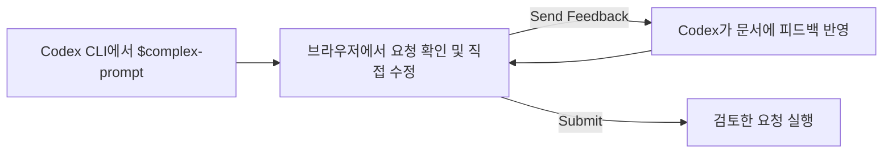

# Codex Complex Prompt

> **Codex CLI 전용 도구입니다.** Codex App에서는 동작을 보장하지 않습니다.

복잡한 작업이나 리서치·문서 작성 요청을 브라우저 에디터에서 작성 및 확인하고, Codex의 피드백을 반영해 검토한 뒤 실행할 수 있습니다. Notion과 비슷한 그림을 그리고 이미지도 함께 보는 마크다운 에디터를 제공합니다.

## 왜 사용하나요?

채팅에서 결과를 확인하고, 잘못된 점을 설명하고, 결과를 복원해 다시 명령하는 일이 반복되면 대화가 길어집니다. 그 사이 AI와 인간이 모두 작업 사항을 잊기도 하고 미처 챙기지 못하는 항목이 생기기도 합니다.

Codex Complex Prompt는 요청을 인간 또는 AI가 편집 가능한 문서로 보여줍니다. 목표와 조건을 직접 고치고, Codex 피드백을 반영한 전체 문서를 다시 확인하면서 작업의 맥락을 유지할 수 있습니다.



## 시작하기

### Codex 플러그인으로 설치

이 저장소는 setup 안내용 `$install-complex-prompt` skill을 포함한 Codex 플러그인 패키지도 제공합니다. `younsang-codex-plugins` marketplace에서 `codex-complex-prompt`를 설치한 뒤, 이 skill이 안내하는 CLI 명령을 사용자가 터미널에서 직접 실행해 hook과 `$complex-prompt` skill을 설정합니다.

### 설치

```bash
npx @codex-complex-prompt/cli-bridge hook install
```

설치가 끝나면 Codex CLI를 재시작합니다. 처음 등록한 훅을 검토하라는 안내가 나오면 Codex 입력창에서 `/hooks`를 열어 확인하고 승인하세요. 설치기는 기존 Codex 훅을 지우지 않고 새 훅을 함께 등록합니다.

### 스킬 사용법

```text
$complex-prompt 결제 기능을 조사하고 구현 요청 문서를 작성해줘
```

- 인자 없이 호출하면 빈 문서 에디터에서 시작합니다.
- `.md` 또는 `.txt` 파일 경로를 입력하면 파일 내용을 초안으로 불러옵니다.
- 그 외 일반 텍스트를 입력하면 해당 내용이 편집기의 초안이 됩니다.

## 에디터에서 작업하기

에디터에서 마크다운을 직접 읽고 수정하세요.

- `Send Feedback`을 보내면 Codex가 피드백을 반영하고, 편집기가 반영한 내용으로 다시 열립니다. 수정 결과를 직접 다듬거나 피드백을 더 보낼 수 있습니다.
- `Submit`을 누르면 검토를 마치고 문서에 담긴 요청을 Codex CLI에 전달해 수행합니다.

문서 작성처럼 익숙한 편집 경험 안에서 프로젝트별 템플릿을 사용하고, 그림을 그리거나 이미지를 붙여 넣을 수 있습니다.
첨부 자료는 프로젝트의 `.complex-prompt/attachments/`에 저장됩니다.

### 템플릿 제공

작성을 처음부터 시작하는 것에 피로감을 느끼거나, 어떤 요소나 구성을 해야할지 모를 때 이를 돕기 위한 문서 템플릿을 제공합니다.

템플릿은 프로젝트별로 저장됩니다. 기본 템플릿을 편집하거나 직접 만든 템플릿을 저장, 편집, 삭제해 프로젝트나 사용자에 맞게 구성 가능합니다.

기본 템플릿은 다음과 같습니다.

- `CO-STAR`: Codex가 어떤 상황에서 무엇을 어떤 형태로 만들어야 하는지 분명해져, 결과의 방향과 형식을 맞추기위한 명령 형식
- `RISEN`: 작업 순서와 제한 사항을 미리 드러내고, 단계가 누락되거나 범위를 벗어날 가능성을 낮추는 명령 형식
- `회의록`: 회의의 맥락을 정리하고, 후속 액션을 AI에게 명령하고자 하는 명령 형식
- `PRD`: 사용자가 겪는 문제와 기능 목표, 요구사항, 완료 기준을 정의하는 문서 형식
- `ADR`: 그동안의 기술 결정을 맥락·대안·결과와 함께 기록하는 문서 형식
- `RFC`: 문제를 해결할 기술 방안을 제안하고 대안과 절충점, 운영 영향을 비교하는 문서 형식

### 그림 그리기

에디터에서 [Excalidraw](https://excalidraw.com/)로 그림을 그리고 문서에 삽입할 수 있습니다. 그림은 문서 안에 표시되며, 편집할 수 있습니다.

## 설정 관리

설치 전에 변경 내용을 확인하려면 다음 명령을 사용하세요.

```bash
npx @codex-complex-prompt/cli-bridge hook install --dry-run
```

설치한 Codex Complex Prompt 항목을 제거하려면 다음을 실행합니다. 다른 사용자의 훅과 설정은 제거하지 않습니다.

```bash
npx @codex-complex-prompt/cli-bridge hook remove
```

## 개발 및 기여

[개발 문서](docs/development.md)를 참고하세요.
