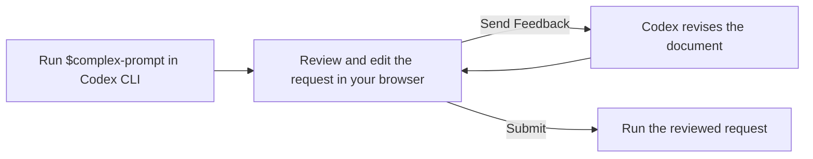

# Codex Complex Prompt

**English** · [한국어](README.ko.md)

> **For Codex CLI only.** This tool is not supported in the Codex app.

Draft and review complex tasks, research requests, and writing prompts in a browser-based Markdown editor. Revise your request with Codex feedback, then submit the version you reviewed. The editor supports diagrams and images alongside your Markdown.

## Why use it?

Repeatedly checking results in chat, explaining what is wrong, and asking Codex to restore or revise them can make a conversation difficult to follow. Important details can also get lost along the way.

Codex Complex Prompt presents your request as a document that you and Codex can revise. Edit the goals and constraints directly, then review the full document with Codex's feedback included before continuing. This keeps the task context in one place.



## Get started

### Install

```bash
npx @codex-complex-prompt/cli-bridge hook install
```

Restart Codex CLI after installation. If Codex asks you to review the newly registered hook, open `/hooks` in the Codex input and approve it. The installer keeps your existing Codex hooks and registers this one alongside them.

### Use the skill

```text
$complex-prompt Research and implement the payment feature
```

- With no argument, the editor opens with a blank document.
- A `.md` or `.txt` file path loads that file as the draft.
- Any other text becomes the editor's draft.

## Work in the editor

Read and edit Markdown directly in the browser editor.

- Select **Send Feedback** to ask Codex to revise the document. The editor reopens with the revised version so you can refine it or send more feedback.
- Select **Submit** to send the reviewed request to Codex CLI for execution.

Use project templates to start from a familiar structure. You can also draw diagrams or paste images into the document. Attachments are stored in the project's `.complex-prompt/attachments/` directory.

### Available templates

Templates help you get started when you are unsure which details or sections to include. They are stored per project, and you can edit, save, or delete them.

The built-in templates cover:

- **CO-STAR**: Shape a prompt around context, objective, style, tone, audience, and response.
- **RISEN**: Define a role, instructions, steps, end goal, and constraints.
- **Meeting follow-up**: Summarize decisions, open questions, and follow-up tasks.
- **PRD**: Describe the user problem, product goals, requirements, and acceptance criteria.
- **ADR**: Record the context, alternatives, decision, and consequences of a technical choice.
- **RFC**: Propose a technical solution and compare alternatives, trade-offs, and operational impact.

### Draw diagrams

Create diagrams with [Excalidraw](https://excalidraw.com/) and insert them into your document. Drawings appear inline and can be edited later.

### Embed videos

Paste or drop a local MP4, MOV, or WebM file into the editor to attach it and show an inline player. Standalone Markdown image references to direct video files and GitHub video attachments are also shown as players. YouTube and other streaming-service URLs remain ordinary links. The original Markdown references stay in the document, and videos the browser cannot play show a placeholder.

## Manage the installation

Preview the changes before installing:

```bash
npx @codex-complex-prompt/cli-bridge hook install --dry-run
```

Remove the Codex Complex Prompt hooks and skills installed by this package. Other users' hooks and settings are left alone.

```bash
npx @codex-complex-prompt/cli-bridge hook remove
```

## Development and contribution

See the [development guide](docs/development.md).
